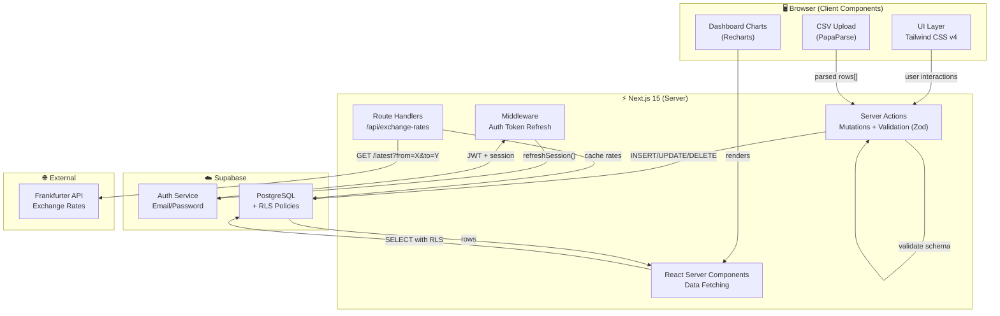
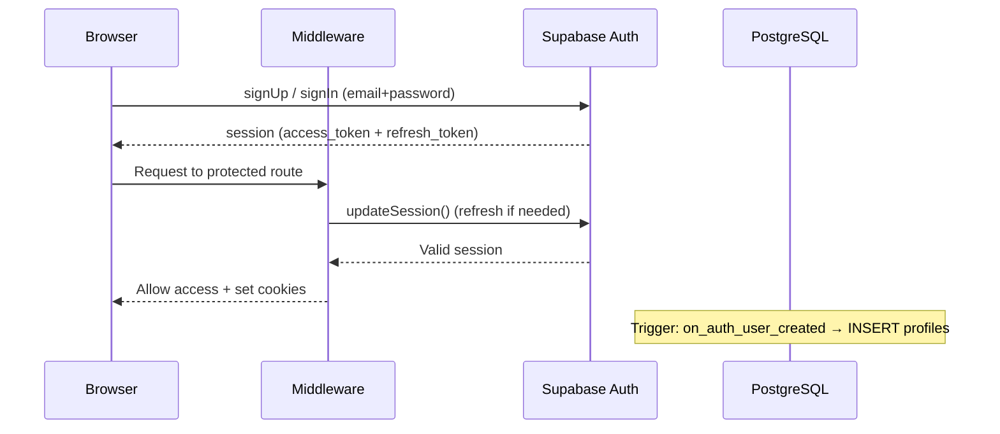
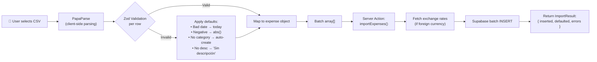

# ARCHITECTURE.md — SmartExpense
> **Fuente de Verdad Inmutable** para todos los agentes de desarrollo.
> Última actualización: 2026-02-12

---

## 1. Tech Stack & Versiones

| Tecnología | Versión | Justificación |
|---|---|---|
| **Next.js** | `15.x` (App Router) | Framework full-stack con RSC, Server Actions y streaming. Elimina la necesidad de un backend separado. |
| **TypeScript** | `5.x` (strict mode) | Tipado estricto obligatorio. Previene errores en tiempo de compilación y mejora la DX. |
| **Tailwind CSS** | `4.x` | CSS utility-first con mejor performance (Lightning CSS engine), integración nativa con Next.js 15. |
| **Supabase** | Latest (`@supabase/ssr`) | Auth (email/password), PostgreSQL, RLS (Row Level Security) para aislamiento de datos por usuario. **No usar `@supabase/auth-helpers` (deprecado).** |
| **Recharts** | `2.x` | Librería de gráficos React declarativa. Ligera, composable y con buen soporte de Pie Charts. |
| **PapaParse** | `5.x` | Parser CSV robusto, soporta streaming de archivos grandes. Ejecutado client-side. |
| **Zod** | `3.x` | Validación de schemas en runtime. Usado en Server Actions y parsing de CSV. |
| **clsx + tailwind-merge** | Latest | Composición condicional de clases Tailwind sin conflictos. |
| **date-fns** | `3.x` | Manipulación de fechas ligera y tree-shakeable. Preferida sobre dayjs/moment. |

### Servicios Externos
| Servicio | Uso | Notas |
|---|---|---|
| **Frankfurter API** | Tasas de cambio para conversión multi-divisa | Gratuito, sin API key. Fallback: almacenar última tasa conocida en DB. |

---

## 2. Domain Model (Supabase PostgreSQL)

### 2.1 Diagrama Entidad-Relación

```
┌─────────────┐       ┌──────────────────┐       ┌──────────────────┐
│  auth.users  │──1:1──│     profiles      │──1:N──│     expenses     │
│  (Supabase)  │       │                  │       │                  │
└─────────────┘       └──────────────────┘       └──────────────────┘
                              │                          │
                              │ 1:N                      │ N:1
                              ▼                          ▼
                       ┌──────────────────┐       ┌──────────────────┐
                       │   categories     │───────│  (FK category_id)│
                       │  (global+user)   │       └──────────────────┘
                       └──────────────────┘
                              │
                       ┌──────────────────┐
                       │ exchange_rates   │ (cache de tasas)
                       └──────────────────┘
```

### 2.2 Schema SQL

```sql
-- ============================================================
-- PROFILES: Extends Supabase auth.users
-- ============================================================
CREATE TABLE public.profiles (
  id            UUID PRIMARY KEY REFERENCES auth.users(id) ON DELETE CASCADE,
  display_name  TEXT NOT NULL DEFAULT '',
  base_currency TEXT NOT NULL DEFAULT 'USD',  -- ISO 4217 (USD, EUR, COP, etc.)
  created_at    TIMESTAMPTZ NOT NULL DEFAULT now(),
  updated_at    TIMESTAMPTZ NOT NULL DEFAULT now()
);

-- Trigger: auto-create profile on user signup
CREATE OR REPLACE FUNCTION public.handle_new_user()
RETURNS TRIGGER AS $$
BEGIN
  INSERT INTO public.profiles (id, display_name)
  VALUES (NEW.id, COALESCE(NEW.raw_user_meta_data->>'display_name', ''));
  RETURN NEW;
END;
$$ LANGUAGE plpgsql SECURITY DEFINER;

CREATE TRIGGER on_auth_user_created
  AFTER INSERT ON auth.users
  FOR EACH ROW EXECUTE FUNCTION public.handle_new_user();

-- ============================================================
-- CATEGORIES: Hybrid (global + user-specific)
-- user_id = NULL → global category (visible to all)
-- user_id = UUID → user-specific category
-- ============================================================
CREATE TABLE public.categories (
  id         UUID PRIMARY KEY DEFAULT gen_random_uuid(),
  user_id    UUID REFERENCES auth.users(id) ON DELETE CASCADE,  -- NULL = global
  name       TEXT NOT NULL,
  icon       TEXT DEFAULT '📦',  -- emoji or icon identifier
  color      TEXT DEFAULT '#6B7280',  -- hex color for charts
  created_at TIMESTAMPTZ NOT NULL DEFAULT now(),

  -- Prevent duplicate category names per user (or globally)
  CONSTRAINT unique_category_per_user UNIQUE (user_id, name)
);

-- Seed global categories
INSERT INTO public.categories (user_id, name, icon, color) VALUES
  (NULL, 'Alimentación',  '🍔', '#EF4444'),
  (NULL, 'Transporte',    '🚗', '#F59E0B'),
  (NULL, 'Vivienda',      '🏠', '#3B82F6'),
  (NULL, 'Entretenimiento','🎬', '#8B5CF6'),
  (NULL, 'Salud',         '💊', '#10B981'),
  (NULL, 'Educación',     '📚', '#6366F1'),
  (NULL, 'Servicios',     '💡', '#F97316'),
  (NULL, 'Otros',         '📦', '#6B7280');

-- ============================================================
-- EXPENSES: Core transaction table
-- ============================================================
CREATE TABLE public.expenses (
  id                    UUID PRIMARY KEY DEFAULT gen_random_uuid(),
  user_id               UUID NOT NULL REFERENCES auth.users(id) ON DELETE CASCADE,
  category_id           UUID NOT NULL REFERENCES public.categories(id) ON DELETE RESTRICT,
  description           TEXT NOT NULL DEFAULT '',
  amount                NUMERIC(12,2) NOT NULL CHECK (amount > 0),
  currency              TEXT NOT NULL DEFAULT 'USD',  -- ISO 4217 original currency
  amount_in_base        NUMERIC(12,2) NOT NULL,       -- converted to user's base_currency
  exchange_rate_used    NUMERIC(14,6) NOT NULL DEFAULT 1.0,
  expense_date          DATE NOT NULL DEFAULT CURRENT_DATE,
  source                TEXT NOT NULL DEFAULT 'manual' CHECK (source IN ('manual', 'csv')),
  created_at            TIMESTAMPTZ NOT NULL DEFAULT now(),
  updated_at            TIMESTAMPTZ NOT NULL DEFAULT now()
);

-- Performance indexes for Dashboard queries
CREATE INDEX idx_expenses_user_date ON public.expenses (user_id, expense_date DESC);
CREATE INDEX idx_expenses_user_category ON public.expenses (user_id, category_id);
CREATE INDEX idx_expenses_user_month ON public.expenses (user_id, (DATE_TRUNC('month', expense_date)));

-- ============================================================
-- EXCHANGE_RATES: Cache to avoid excessive API calls
-- ============================================================
CREATE TABLE public.exchange_rates (
  id          UUID PRIMARY KEY DEFAULT gen_random_uuid(),
  base        TEXT NOT NULL,  -- e.g., 'EUR' (Frankfurter uses EUR as base)
  target      TEXT NOT NULL,
  rate        NUMERIC(14,6) NOT NULL,
  fetched_at  DATE NOT NULL DEFAULT CURRENT_DATE,

  CONSTRAINT unique_rate_per_day UNIQUE (base, target, fetched_at)
);

CREATE INDEX idx_exchange_rates_lookup ON public.exchange_rates (base, target, fetched_at DESC);
```

### 2.3 Row Level Security (RLS)

```sql
-- Enable RLS on all tables
ALTER TABLE public.profiles ENABLE ROW LEVEL SECURITY;
ALTER TABLE public.categories ENABLE ROW LEVEL SECURITY;
ALTER TABLE public.expenses ENABLE ROW LEVEL SECURITY;
ALTER TABLE public.exchange_rates ENABLE ROW LEVEL SECURITY;

-- PROFILES: Users can only read/update their own profile
CREATE POLICY "profiles_select_own" ON public.profiles
  FOR SELECT USING (auth.uid() = id);
CREATE POLICY "profiles_update_own" ON public.profiles
  FOR UPDATE USING (auth.uid() = id);

-- CATEGORIES: Users can see global + own categories
CREATE POLICY "categories_select" ON public.categories
  FOR SELECT USING (user_id IS NULL OR user_id = auth.uid());
CREATE POLICY "categories_insert_own" ON public.categories
  FOR INSERT WITH CHECK (user_id = auth.uid());
CREATE POLICY "categories_update_own" ON public.categories
  FOR UPDATE USING (user_id = auth.uid());
CREATE POLICY "categories_delete_own" ON public.categories
  FOR DELETE USING (user_id = auth.uid());

-- EXPENSES: Users can only CRUD their own expenses
CREATE POLICY "expenses_select_own" ON public.expenses
  FOR SELECT USING (user_id = auth.uid());
CREATE POLICY "expenses_insert_own" ON public.expenses
  FOR INSERT WITH CHECK (user_id = auth.uid());
CREATE POLICY "expenses_update_own" ON public.expenses
  FOR UPDATE USING (user_id = auth.uid());
CREATE POLICY "expenses_delete_own" ON public.expenses
  FOR DELETE USING (user_id = auth.uid());

-- EXCHANGE_RATES: Read-only for all authenticated users
CREATE POLICY "exchange_rates_select" ON public.exchange_rates
  FOR SELECT USING (auth.role() = 'authenticated');
```

---

## 3. System Design

### 3.1 Diagrama de Flujo de Datos (Mermaid)



### 3.2 Flujo de Autenticación



### 3.3 Flujo de Importación CSV



---

## 4. Project Structure

```
src/
├── app/                          # Next.js App Router
│   ├── (auth)/                   # Route group: public auth pages
│   │   ├── login/
│   │   │   └── page.tsx
│   │   ├── signup/
│   │   │   └── page.tsx
│   │   └── layout.tsx            # Auth layout (centered, minimal)
│   │
│   ├── (dashboard)/              # Route group: protected pages
│   │   ├── dashboard/
│   │   │   └── page.tsx          # Main dashboard (totals + pie chart)
│   │   ├── expenses/
│   │   │   ├── page.tsx          # Expense list + manual entry
│   │   │   └── import/
│   │   │       └── page.tsx      # CSV upload page
│   │   ├── categories/
│   │   │   └── page.tsx          # Category management (CRUD)
│   │   ├── settings/
│   │   │   └── page.tsx          # User settings (base currency, profile)
│   │   └── layout.tsx            # Dashboard layout (sidebar + topbar)
│   │
│   ├── api/
│   │   └── exchange-rates/
│   │       └── route.ts          # GET: fetch & cache rates from Frankfurter
│   │
│   ├── layout.tsx                # Root layout (html, body, providers)
│   ├── page.tsx                  # Landing/redirect to dashboard
│   ├── globals.css               # Tailwind v4 imports
│   └── not-found.tsx
│
├── components/
│   ├── ui/                       # Reusable atomic UI components
│   │   ├── button.tsx
│   │   ├── input.tsx
│   │   ├── select.tsx
│   │   ├── card.tsx
│   │   ├── dialog.tsx
│   │   ├── data-table.tsx
│   │   └── file-upload.tsx
│   ├── dashboard/
│   │   ├── monthly-total.tsx     # Server Component: total del mes
│   │   ├── category-pie-chart.tsx # Client Component: Recharts pie
│   │   └── recent-expenses.tsx   # Server Component: últimos gastos
│   ├── expenses/
│   │   ├── expense-form.tsx      # Client Component: formulario manual
│   │   ├── expense-list.tsx      # Server Component: lista paginada
│   │   └── csv-import-form.tsx   # Client Component: upload + preview
│   ├── categories/
│   │   ├── category-form.tsx
│   │   └── category-list.tsx
│   └── layout/
│       ├── sidebar.tsx
│       ├── topbar.tsx
│       └── auth-button.tsx
│
├── lib/
│   ├── supabase/
│   │   ├── client.ts             # createBrowserClient (client components)
│   │   ├── server.ts             # createServerClient (server components)
│   │   ├── middleware.ts         # updateSession helper
│   │   └── admin.ts              # Service role client (if needed)
│   ├── validators/
│   │   ├── expense.schema.ts     # Zod schemas for expense validation
│   │   ├── category.schema.ts
│   │   ├── csv-row.schema.ts     # Zod schema for CSV row parsing
│   │   └── auth.schema.ts
│   └── utils/
│       ├── cn.ts                 # clsx + tailwind-merge helper
│       ├── currency.ts           # Currency formatting + conversion logic
│       ├── csv-parser.ts         # PapaParse wrapper + default application
│       ├── date.ts               # date-fns helpers
│       └── constants.ts          # App-wide constants (supported currencies, etc.)
│
├── services/                     # Domain/Business logic layer
│   ├── expense.service.ts        # CRUD operations for expenses
│   ├── category.service.ts       # CRUD + auto-create logic for categories
│   ├── exchange-rate.service.ts  # Fetch, cache, and convert rates
│   └── dashboard.service.ts      # Aggregation queries for dashboard
│
├── actions/                      # Next.js Server Actions
│   ├── expense.actions.ts        # createExpense, updateExpense, deleteExpense, importCSV
│   ├── category.actions.ts       # createCategory, updateCategory, deleteCategory
│   ├── auth.actions.ts           # signIn, signUp, signOut
│   └── settings.actions.ts       # updateProfile, updateBaseCurrency
│
├── types/
│   ├── database.ts               # Supabase generated types (npx supabase gen types)
│   ├── expense.ts                # Domain types for expenses
│   ├── category.ts               # Domain types for categories
│   ├── csv.ts                    # ImportResult, CSVRow, ParsedExpense
│   └── dashboard.ts              # ChartData, MonthlyTotal, etc.
│
├── hooks/                        # Custom React hooks (client-side)
│   ├── use-expenses.ts
│   └── use-csv-import.ts
│
└── middleware.ts                  # Root middleware: auth token refresh

# Root config files
├── .env.local                    # NEXT_PUBLIC_SUPABASE_URL, NEXT_PUBLIC_SUPABASE_ANON_KEY
├── .env.example                  # Template for required env vars
├── next.config.ts
├── tailwind.config.ts            # Tailwind v4 config (if needed, v4 uses CSS-first)
├── tsconfig.json                 # Strict mode enabled
├── package.json
├── CONTEXT.md                    # External lib context (MCP source of truth)
├── ARCHITECTURE.md               # This file
└── .github/
    └── copilot-instructions.md   # Agent operational directives
```

### Decisiones de Estructura

| Decisión | Razón |
|---|---|
| **`services/` separado de `actions/`** | Separation of Concerns: los services contienen lógica de negocio pura y reutilizable; las actions son el punto de entrada de Next.js que orquestan validación + service + revalidación. |
| **`lib/validators/` con Zod** | Single source of truth para validación. Se reusan tanto en Server Actions (server-side) como en formularios (client-side). |
| **Route groups `(auth)` y `(dashboard)`** | Layouts independientes sin afectar la URL. Auth tiene layout minimal; Dashboard tiene sidebar. |
| **`components/ui/` atómicos** | Componentes genéricos reutilizables. Base para una posible migración a shadcn/ui en el futuro. |

---

## 5. Implementation Plan (Roadmap)

### Fase 0 — Scaffolding & Configuración Base
> **Objetivo:** Proyecto funcional con auth y navegación base.

| # | Tarea | Criterio de Aceptación | Archivos Clave |
|---|---|---|---|
| 0.1 | Inicializar Next.js 15 con TypeScript + Tailwind v4 | `npm run dev` sin errores | `package.json`, `next.config.ts`, `globals.css` |
| 0.2 | Configurar Supabase: proyecto, env vars, tipos generados | Conexión exitosa desde server component | `.env.local`, `lib/supabase/*` |
| 0.3 | Implementar Auth (login/signup) con `@supabase/ssr` | Usuario puede registrarse e iniciar sesión | `app/(auth)/*`, `actions/auth.actions.ts` |
| 0.4 | Middleware de Auth + protección de rutas | Redirect a `/login` si no autenticado | `middleware.ts` |
| 0.5 | Layout del Dashboard (sidebar + topbar) | Navegación funcional entre secciones | `app/(dashboard)/layout.tsx`, `components/layout/*` |

### Fase 1 — Categorías (CRUD Híbrido)
> **Objetivo:** Sistema de categorías global + personalizado operativo.

| # | Tarea | Criterio de Aceptación | Archivos Clave |
|---|---|---|---|
| 1.1 | Ejecutar migración SQL: tabla `categories` + seed globals | 8 categorías globales en DB | SQL migration |
| 1.2 | RLS policies para categorías | User ve globales + propias; no puede editar globales | SQL migration |
| 1.3 | Server Actions: CRUD de categorías de usuario | Crear, editar, eliminar categorías propias | `actions/category.actions.ts`, `services/category.service.ts` |
| 1.4 | UI: Página de gestión de categorías | Listado con indicador global/personal, formulario CRUD | `app/(dashboard)/categories/page.tsx` |

### Fase 2 — Gastos Manuales (CRUD)
> **Objetivo:** Ingreso y gestión manual de gastos con moneda única.

| # | Tarea | Criterio de Aceptación | Archivos Clave |
|---|---|---|---|
| 2.1 | Migración SQL: tabla `expenses` + índices | Tabla creada con constraints | SQL migration |
| 2.2 | RLS policies para expenses | User solo ve/edita sus gastos | SQL migration |
| 2.3 | Zod schemas de validación | Schema valida amount > 0, fecha válida, category existe | `lib/validators/expense.schema.ts` |
| 2.4 | Server Actions: CRUD de gastos | Crear, editar, eliminar gastos (source='manual') | `actions/expense.actions.ts` |
| 2.5 | UI: Formulario de gasto + lista paginada | Formulario funcional, lista con paginación, filtro por mes | `components/expenses/*`, `app/(dashboard)/expenses/page.tsx` |

### Fase 3 — Multi-Divisa
> **Objetivo:** Soporte de múltiples monedas con conversión automática.

| # | Tarea | Criterio de Aceptación | Archivos Clave |
|---|---|---|---|
| 3.1 | Migración SQL: tabla `exchange_rates` | Tabla de caché de tasas creada | SQL migration |
| 3.2 | Route Handler: `/api/exchange-rates` | Fetch de Frankfurter API + cache en DB | `app/api/exchange-rates/route.ts` |
| 3.3 | Exchange Rate Service | Obtener tasa, cachear, calcular conversión con fallback | `services/exchange-rate.service.ts` |
| 3.4 | Integrar conversión en creación de gastos | `amount_in_base` calculado automáticamente al crear gasto | `services/expense.service.ts` |
| 3.5 | UI: Selector de moneda en formulario + setting de moneda base | Dropdown de moneda en form, config en settings | `components/expenses/expense-form.tsx`, `app/(dashboard)/settings/page.tsx` |

### Fase 4 — Importación CSV
> **Objetivo:** Upload de CSV con parsing, validación y aplicación de defaults.

| # | Tarea | Criterio de Aceptación | Archivos Clave |
|---|---|---|---|
| 4.1 | CSV Parser con PapaParse + Zod | Parse client-side, validar cada fila, aplicar defaults | `lib/utils/csv-parser.ts`, `lib/validators/csv-row.schema.ts` |
| 4.2 | Lógica de auto-creación de categorías | Si categoría CSV no existe → crear para el usuario | `services/category.service.ts` |
| 4.3 | Server Action: `importExpenses()` | Batch insert con conversión de moneda | `actions/expense.actions.ts` |
| 4.4 | UI: Upload + preview + resultado | Drag & drop, preview de filas, reporte de defaults aplicados / errores | `components/expenses/csv-import-form.tsx`, `app/(dashboard)/expenses/import/page.tsx` |

### Fase 5 — Dashboard
> **Objetivo:** Vista principal con métricas y gráfico de torta.

| # | Tarea | Criterio de Aceptación | Archivos Clave |
|---|---|---|---|
| 5.1 | Dashboard Service: queries de agregación | Total del mes + gastos por categoría (en moneda base) | `services/dashboard.service.ts` |
| 5.2 | Server Component: Total mensual | Muestra total gastado del mes actual en moneda base | `components/dashboard/monthly-total.tsx` |
| 5.3 | Client Component: Gráfico de torta | Pie chart con Recharts, colores por categoría, tooltips | `components/dashboard/category-pie-chart.tsx` |
| 5.4 | Server Component: Últimos gastos | Lista de los 5-10 gastos más recientes | `components/dashboard/recent-expenses.tsx` |
| 5.5 | Composición de la página Dashboard | Integrar todos los widgets en layout responsivo | `app/(dashboard)/dashboard/page.tsx` |

### Fase 6 — Hardening & Polish
> **Objetivo:** Robustez, UX y preparación para producción.

| # | Tarea | Criterio de Aceptación |
|---|---|---|
| 6.1 | Loading states (Suspense boundaries) | Skeletons en dashboard y listas |
| 6.2 | Error boundaries + toast notifications | Errores mostrados con feedback claro al usuario |
| 6.3 | Responsive design (mobile-first) | Sidebar colapsable, tablas scrollables |
| 6.4 | Metadata + SEO básico | `<title>`, `<meta>` en todas las páginas |
| 6.5 | Rate limiting en API de exchange rates | Máximo 1 fetch por par de monedas por día |
| 6.6 | Tests E2E (opcional, recomendado) | Flujos críticos: login → crear gasto → ver dashboard |

---

## 6. Reglas para Agentes de Desarrollo

> Estas reglas deben ser seguidas por cualquier agente (Copilot Edits, etc.) que trabaje en este proyecto.

1. **NO modificar este archivo** (`ARCHITECTURE.md`) sin aprobación explícita del usuario.
2. **Consultar `CONTEXT.md`** antes de usar APIs de Next.js, Supabase o Tailwind.
3. **TypeScript estricto:** No usar `any`. Preferir tipos generados por Supabase (`types/database.ts`).
4. **Server Components por defecto.** Solo usar `"use client"` cuando sea necesario (interactividad, hooks, eventos).
5. **Validación con Zod** en todos los Server Actions. No confiar en datos del cliente.
6. **RLS es la última línea de defensa.** Aunque el código filtre por `user_id`, las políticas RLS deben estar activas siempre.
7. **No hardcodear credenciales.** Todo en `.env.local`.
8. **Cada fase es atómica y testeable.** No avanzar a la siguiente fase sin completar la anterior.
9. **Imports absolutos** usando `@/` (configurado en `tsconfig.json`).
10. **Comentarios en inglés, UI y respuestas al usuario en español.**

---

## 7. Formato CSV Esperado

```csv
date,amount,currency,category,description
2026-01-15,45.50,USD,Alimentación,Almuerzo de trabajo
2026-01-16,120.00,EUR,Transporte,Uber al aeropuerto
```

### Reglas de Defaults (Importación Forzada)

| Campo | Valor Inválido | Default Aplicado |
|---|---|---|
| `date` | Formato incorrecto, fecha futura > +1 día | `CURRENT_DATE` (hoy) |
| `amount` | Negativo | `abs(amount)` |
| `amount` | No numérico, vacío, cero | **Fila descartada** (no hay default sensato) |
| `currency` | Código no reconocido, vacío | Moneda base del usuario (`profiles.base_currency`) |
| `category` | No existe (ni global ni del usuario) | **Auto-crear** como categoría del usuario |
| `description` | Vacío | `'Sin descripción'` |

---

## 8. Variables de Entorno Requeridas

```env
# .env.local
NEXT_PUBLIC_SUPABASE_URL=https://xxxxx.supabase.co
NEXT_PUBLIC_SUPABASE_ANON_KEY=eyJhbGciOiJIUzI1NiIs...
SUPABASE_SERVICE_ROLE_KEY=eyJhbGciOiJIUzI1NiIs...  # Solo server-side, nunca exponer

# Opcional: Override de URL de exchange rates
EXCHANGE_RATE_API_URL=https://api.frankfurter.app
```
